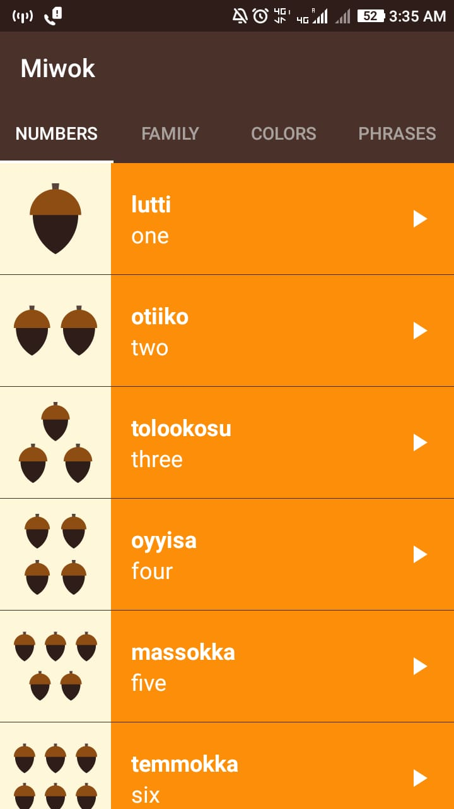
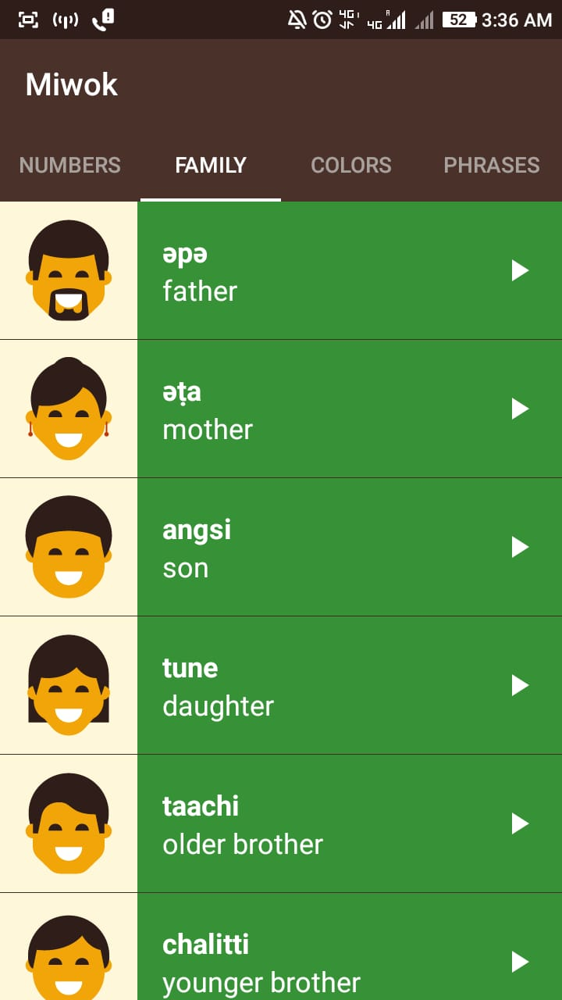
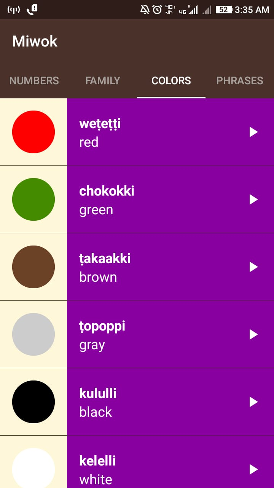
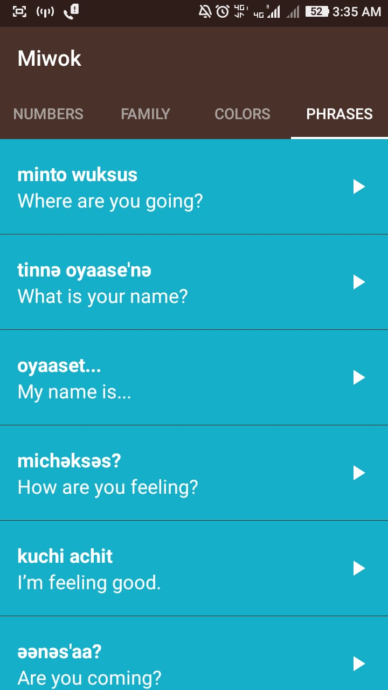

# Miwok
This app helps to learn Miwok Langauge. I have included numbers , family members , colours and some commom phrases translation to Miwok langauge. We can learn a new langauge correctly if we
have the pronunciation of the words of that langauge , this inspired me to add audio of the translations to the app. 
You can tap on the item to get it's miwok pronunciation. I learnt about audio managers , adapters , ListViews , gridViews and fragments through this app. I also gained some insigths of activity lifecycle also.

Here are the screenshots of the app. I hope you will Enjoy learning the Miwok langauge through this app.

    
